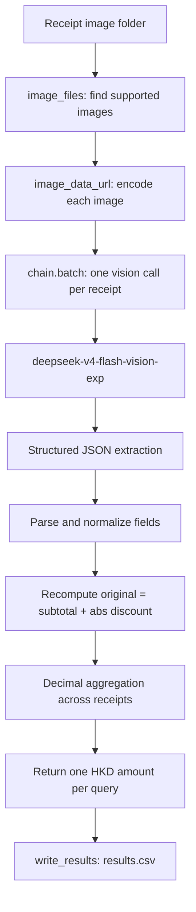

# FTEC5660 Homework 1: Receipt Chain

Build a LangChain pipeline that reads every supermarket receipt in a folder
with the vision-capable DeepSeek Flash model and answers these two questions:

1. How much money did I spend in total for these bills?
2. How much would I have had to pay without the discount?

For this homework, **amount spent** means the final payment after the receipt's
rounding line. **Without the discount** means the sum of the original positive
item prices: add back every promotion, coupon, member, app, packaging-damage,
and percentage discount, but do not add back rounding.

## Student task

Only edit the two functions in `hw1.py` that contain `### YOUR CODE HERE`:

- `build_chain()` creates your LangChain chain.
- `answer_queries()` runs the chain on the receipt images and returns one final
  response for each question.

You may use prompt chaining, routing, parallel calls, reflection, or a
combination. Your final responses should each contain one HKD amount. Do not
hard-code filenames or public answers; grading uses unseen receipt folders.

## Setup and public test

```bash
python3 -m venv .venv
source .venv/bin/activate
pip install -r requirements.txt
```

Put your DeepSeek key after `DEEPSEEK_API_KEY=` in `.env`, then run:

```bash
python3 hw1.py --image-folder public_test
```

The program creates `results.csv` in the current directory. Its columns are
`query`, `model_response`, and `correctness`. The public answers are in
`public_test/ground_truth.json`. The starter intentionally returns the dummy
response `please design your chain to answer these two queries.` so it runs
before you add any API code.

The required model is `deepseek-v4-flash-vision-exp`, the vision-capable
DeepSeek Flash model. JPEG, PNG, GIF, and WebP inputs are accepted by the
homework runner.


## Homework 1 Solution

The implementation separates **per-receipt extraction** from **final calculation**. `build_chain()` creates one LangChain sequence that sends each receipt image and a strict accounting prompt to `deepseek-v4-flash-vision-exp`. The prompt asks the model to return four JSON fields: the final `paid_amount` after the rounding line, the printed `subtotal_after_discounts_before_rounding`, the positive `discount_total` obtained by adding back all promotion/coupon/member/app/packaging-damage/percentage discounts, and an `original_total`. The model is treated as a vision-based information extractor rather than as the final calculator. `answer_queries()` converts every image to a data URL, runs the extraction chain in parallel with `chain.batch()`, parses the JSON response, takes the absolute value of every discount amount, and recomputes `original_total = subtotal_after_discounts_before_rounding + discount_total` in Python. The model's own `original_total` is retained as a cross-check and fallback, while the Python-recomputed value is authoritative when both subtotal and discount are available. It then sums all per-receipt values with `Decimal` and returns exactly one HKD amount for each of the two fixed queries. This design keeps the arithmetic deterministic, prevents floating-point errors, excludes `ROUNDING` from the without-discount answer, and makes the final answers easy to audit. `results.csv` contains two aggregate data rows because the assignment asks for two folder-level answers, even when the folder contains seven or more receipt images; the per-receipt values are intermediate results.

### Chain design



### Accounting rules encoded in the prompt

- **Amount paid:** use the final payment or tender line after `ROUNDING`, not the subtotal.
- **Subtotal:** use the printed `SUBTOTAL` after discounts but before `ROUNDING`.
- **Discount total:** add back every promotion, coupon, member, app, packaging-damage, percentage-off, and similar discount line as a positive value.
- **Without discount:** calculate `subtotal_after_discounts_before_rounding + discount_total`; do not add or subtract `ROUNDING`.
- **Aggregation:** do the final addition in Python with `Decimal`, never in the language model.

### Inspecting the extraction process

Set `HW1_DEBUG=1` to print the model's raw JSON response, the parsed per-receipt values, the recomputed values, and the running totals:

```bash
HW1_DEBUG=1 python3 hw1.py --image-folder public_test
```

Without `HW1_DEBUG`, the program keeps the normal output and writes only the required two-row `results.csv`.
